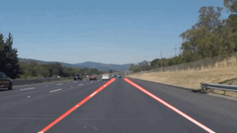
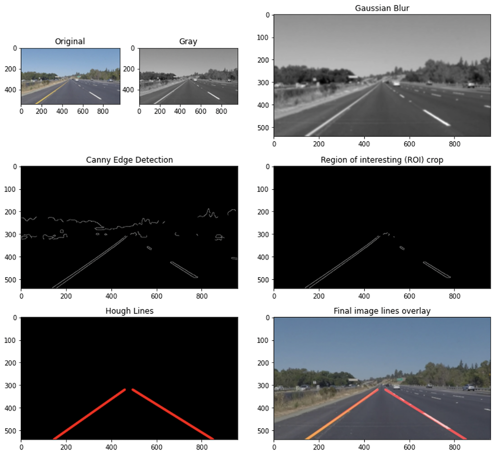

# **Finding Lane Lines on the Road**
Self-Driving Car Engineer Nanodegree Program

---
## Project Details
When we drive, we use our eyes to decide where to go.  The lines on the road that show us where the lanes are act as our constant reference for where to steer the vehicle.  Naturally, one of the first things we would like to do in developing a self-driving car is to automatically detect lane lines using an algorithm.

The goal of this project is to make a pipeline that finds lane lines on the road. In the implementation we detect lane lines in images using Python and OpenCV.

<!--  -->

---
## Implementation Details
Below you will find a summary of the essential details about the repository, files, installation and required dependencies. The project contains various files essential to whole pipeline of the implementation:

* `P1.ipynb`: jupyter notebook with the code that implements simple lane line tracking
* `P1.html`: HTML export of the jupyter notebook
* `test_video_output/solidWhiteRight.mp4` and `test_video_output/solidYellowLeft.mp4`: videos of the tracking of lane lines on a highway
* `test_images`: test images used during implemetation
* `test_videos/`: folder containing the raw videos where the lines were tracked
<!-- * `Additional videos`
    * YouTube -->

---
## Reflection

### Implementation Pipeline pipeline
The pipeline consists of the following steps.

1. Convert the input image/video to gray scale
1. Apply Gaussian blur with a kernel size of 15
1. Apply Canny edge detection to find relevant lines in the image
1. Crop the image to a given region of interest (ROI)
1. Apply Hough transform to find signification lines in the image
1. Overlay the found lines to the original RGB image/video

In order to draw a single line on the left and right lanes, I modified the draw_lines() function by first calculating the slop of the incoming lines. If the slope is positive it belongs to the right lane line, and if negavetive it belongs to the left lane line. The individual (x,y) points (vertices) were then sorted into two arrays. Two first-order polynomial were fitted to the right and left points using np.polyfit(x,y,1). Hereafter two lines were drawn within the limits of the image boundary.

### Identify potential shortcomings with your current pipeline
One potential shortcoming would be the instability to changing lighting conditions, shadows and colors. Additionally, the tracking of smaller line segments makes the final line detection for those areas become were eradic and not that confident.

### Suggest possible improvements to your pipeline
A possible improvement would be to different color spaces to increase the stability of tracking under varying lighting conditions. The instability of the final line detection from draw_lines() could perhaps be improved by better fitting or averagining the points detected.

---
## Author

Simon Bøgh